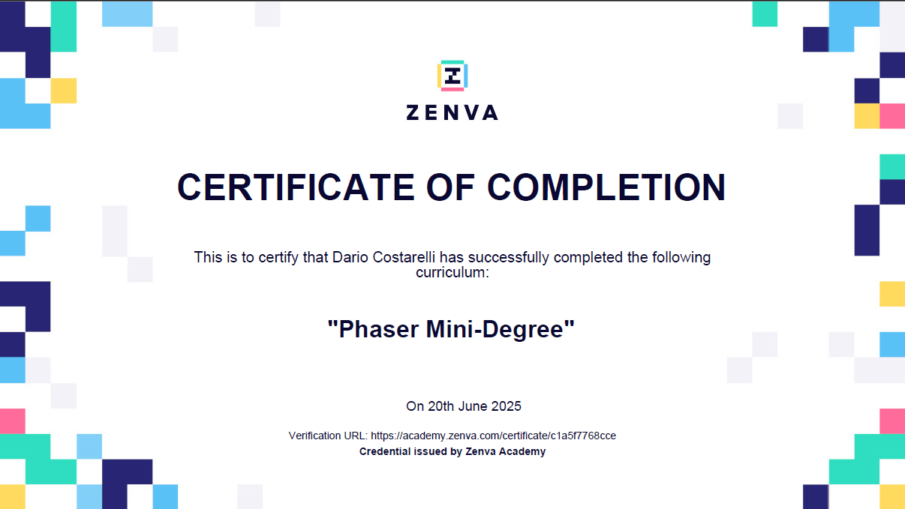
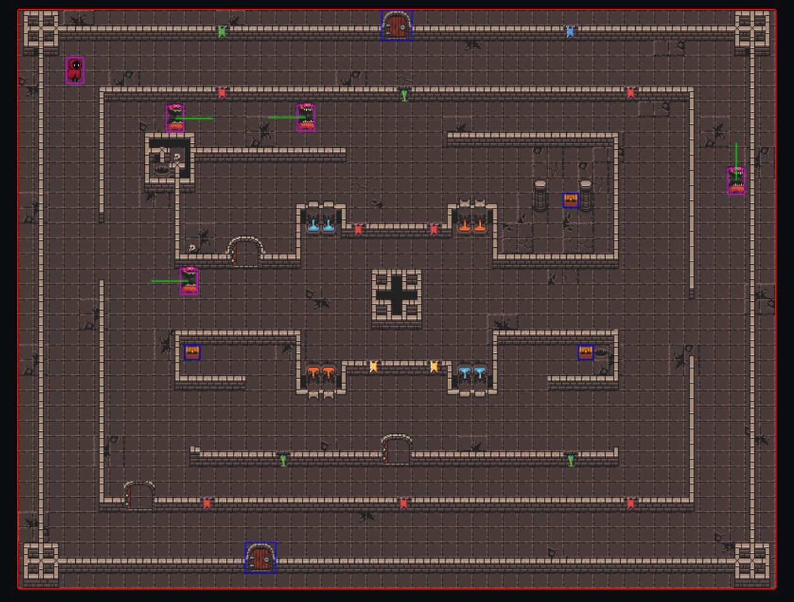

<h1 align="center">
  
  Milestone Project 2: Dungeon Escape!
</h1>

<p align="center">
  <em><strong>
    A simple dungeon escape game made with HTML, CSS, JavaScript and Phaser 3.<br>
    Find the key, avoid monsters, and escape the dungeon!
  </strong></em>
</p>

---

## 👉 [Play Dungeon Escape](https://drake-designer.github.io/Dungeon-Escape/)


---

## Table of Contents

1. [Project Overview](#project-overview)
2. [User Experience Design](#user-experience-design)
   - [User Stories](#user-stories)
   - [Structure](#structure)
   - [Design](#design)
     - [Wireframes](#wireframes)
     - [Colour Palette](#colour-palette)
     - [Typography](#typography)
3. [Technologies Used](#technologies-used)
4. [Testing & Bug Fixes](#testing--bug-fixes)
5. [Validation](#validation)
6. [Deployment](#deployment)
7. [Credits](#credits)
8. [Behind the Scenes!](#behind-the-scenes)

---

## Project Overview

Welcome to **Dungeon Escape!**

You are the hero, stuck in a dark dungeon... Your mission?

> Find one of the hidden keys, avoid the monsters or they will eat you, and unlock the door to escape!

### Game Features

- Move freely in real-time.
- Monsters move around the dungeon, and they’ll chase you if you’re not careful!
- Three chests to reach: two have the key, one is empty!
- If a monster catches you, you lose!
- Playable on desktop and mobile.

### Difficulty Levels

You can now choose between **three difficulty levels** before starting the game!  
Each level changes the **number of monsters** in the dungeon and **how fast they move**:

- **Easy**: Fewer, slower monsters.
- **Medium**: More, faster monsters.
- **Hard**: The most monsters, at the highest speed!

Pick your difficulty for a casual run, or challenge yourself for a true dungeon escape!

---

### Scope

The game is designed to practice JavaScript and Phaser 3 for classic grid-based gameplay:

- Free movement on a grid with walls and paths
- Real-time action movements
- Monsters moving randomly across the dungeon
- Three chests, only two have keys to open the doors
- Player must find a key, unlock a door, and escape while avoiding monsters
- If a monster catches you, you lose!

---

### How Dungeon Escape! Was Born

Dungeon Escape! was one of the most ‘dangerous’, risky… but also super fun and satisfying challenges I’ve ever done so far.

> Why did I decide to present this as my PP2?

Because since I was a kid, I’ve always wanted to create a game (even a simple or basic one) from scratch, with my own ideas and mechanics. So, while I was trying to figure out what to do for PP2, I came across [Phaser](https://phaser.io), a game framework that I fell in love with at first sight.

That’s it… I just told myself: “Let’s do something crazy, I want to present a game that I built myself as my project!”

Since I had no idea how Phaser worked, I decided to start with [Making your first Phaser 3 game](https://phaser.io/tutorials/making-your-first-phaser-3-game) from the official Phaser website, just to learn the basics. Then, I found a mini-course on Zenva ([Phaser Mini-Degree](https://academy.zenva.com/product/html5-game-phaser-mini-degree/)) to learn more features and figure out how to use the Phaser logic in JavaScript.

I have to say, it was tough, and I definitely didn’t manage to learn everything at all… but at least I got to understand a lot of the mechanics and how to structure Dungeon Escape!

So before starting the real project, I began with two walkthrough projects that were super important to help me understand how Phaser works.

My github links projects:

- [Phaser First Game Tutorial](https://github.com/Drake-Designer/Phaser-First-Game-Tutorial)
- [Road Crossing Game](https://github.com/Drake-Designer/Road-Crossing-Game)

And… even if I’ve already forgotten more than half of what I learned 😅, I still managed to get the mini-Phaser diploma! (But I definitely need to go back to the course, because there’s still a lot I need to learn properly and I didn’t have time to focus as much as I wanted!)



This whole experience really pushed me out of my comfort zone, but it made me even more excited to keep learning and building new things!

---

## User Experience Design

### User Stories

- As a player, I want to play an old-style pixel art game like the ones from the ‘80s.
- I want to control my hero with the arrow keys or WASD (on desktop) or by tapping the screen (on mobile).
- I want clear instructions on how to play and win.
- I want the game to work on my phone or computer, so I can play anywhere.
- I want a simple, clean interface, not too many buttons or menus.
- I want to have fun by trying to escape the dungeon, find keys, and avoid monsters.

### Structure

- When the game loads, I see a big title of the game and a message: “Click or Tap to play!”
- The game fills the center of the screen, with a nice dark background.
- The controls are simple:
  - Arrow keys or WASD to move (desktop)
  - Tap around your hero to move (mobile)
- There’s a “How to Play” modal with clear instructions.

### Design

#### Wireframes

The layout for Dungeon Escape has been made using [Balsamiq](https://balsamiq.com/) fusing different devices templates to simulate the user's view of the website in different devices.

This made it easy to see where to put important elements like the navbar, the game instructions, and the main game area.

I created wireframes for:

- **Desktop PC**
- **iPad PRO**
- **iPhone SE**
- **Samsung Galaxy S20 Ultra**

Each version shows:

- **A simple navbar at the top**
- **The game title and short instructions**
- **The main game image or area in the center**
- **A footer at the bottom**

These wireframes helped me make sure the game looks clean and easy to use on all devices.


#### Colour Palette

The game uses a simple palette to make everything feel like an old-school dungeon:

| Name             | Hex Code  | Use                                 |
| ---------------- | --------- | ----------------------------------- |
| Main Background  | `#0b0c10` | Dark background for the whole page  |
| Panel Background | `#1c1e22` | For panels, modals, and borders     |
| Main Text        | `#ffffff` | Main text (easy to read)            |
| Secondary Text   | `#58595c` | Less important text                 |
| Primary Accent   | `#ffb600` | Gold color for icons and highlights |
| Secondary Accent | `#00c89a` | Teal color for extra highlights     |

This dark palette makes the gold and teal really pop, just like in retro games.


#### Typography

The game uses a mix of modern and retro fonts to create a fun, arcade-style feeling. Different font families are used for different parts of the site and game. All fonts are loaded from [Google Fonts](https://fonts.google.com/).

| Where it's used            | Font family       | What it's for                       |
| -------------------------- | ----------------- | ----------------------------------- |
| Navigation bar             | Pirata One        | Used for the main menu / navbar     |
| Game lore and special text | Uncial Antiqua    | For story sections and special text |
| Main titles                | Cinzel Decorative | For big titles and headers          |
| Arcade/game text           | Press Start 2P    | For retro arcade text in the game   |
| General/secondary text     | Roboto            | Used for body text and modals       |

```css /*
/* Font families */

--font-nav-bar: 'Pirata One', cursive; /* Navbar font */
--font-lore: 'Uncial Antiqua', cursive; /* Mase text */
--font-secondary: 'Roboto', serif; /* Secondary and Modal text */
--font-title: 'Cinzel Decorative', serif; /* Main titles */
--font-arcade: 'Press Start 2P', monospace; /* Phaser */
```

Fonts are loaded from Google Fonts for that authentic retro feel.

---

## Technologies Used

### Core Web Technologies & Game Engine

- HTML
- CSS
- JavaScript
- [Phaser 3.90](https://phaser.io) – Game engine!

### Development & Asset Creation Tools

- [Tiled](https://www.mapeditor.org) – Map editor
- [Piskel](https://www.piskelapp.com) – Pixel art sprite editor
- [Photopea](https://www.photopea.com) – Online graphics editor
- [RealFaviconGenerator](https://realfavicongenerator.net) – Favicon generator

### Art & Asset Resources

- [OpenGameArt](https://opengameart.org) – Free game assets
- [Itch.io](https://itch.io) – Free game assets
- [CraftPix](https://craftpix.net) – Free game assets

---

## Testing & Bug Fixes

### 🐞 BUG 1: Game Container & Phaser Canvas Sizing

When I started building **Dungeon Escape!**, I wanted my Phaser game window to fit perfectly inside a `<div>` game-area on my web page, always centered and responsive.

But I had to face a problem: the Phaser canvas never fit exactly inside my container!
Sometimes there was a small part sticking out, or some borders were missing, or the canvas wasn’t fully centered.
I tried changing scale modes, CSS tricks, Bootstrap, different aspect ratios... nothing really worked.

My HTML looked like this:

```cs
<main class="main-container">
  <div id="game-container"></div>
</main>
```

And my Phaser config had:

```cs
scale: {
  mode: Phaser.Scale.FIT,
  autoCenter: Phaser.Scale.CENTER_BOTH,
  width: 800,
  height: 600,
  parent: 'game-container'
}
```

But the canvas still didn’t fit right in all browsers and on all screens.

#### The Solution (Thanks, Discord!):

After lots of searching, I asked for help on Discord (see screenshots below!).


A kind user suggested this simple strategy:


In the end, I decided to wrap the canvas in an extra `<div id="game-border">` to have better control over the border and centering with another CSS workaround:

```cs
/* -----------------------------------> Game container */

.main-container {
  flex: 1 0 auto;
  display: flex;
  justify-content: center;
}

#game-border {
  width: 100%;
  max-width: 1200px;
  border: 2px solid red;
  border-radius: 4px;
  background: var(--bg-main);
}

#game-container {
  width: 100%;
  height: 100%;
}

canvas {
  width: 100% !important;
  height: 100% !important;
  border-radius: 2px;
}
```

That solution actually worked pretty well!

Also, I realized I could make things even cleaner by using the parent property in my Phaser config to directly attach the game to my container div.

Here’s the Phaser config I used:

```cs
const config = {
  type: Phaser.AUTO,
  width: 800,
  height: 608,
  parent: 'game-container',
  physics: { default: 'arcade', arcade: { debug: true } },
  scene: [startScene, mainScene],
};
```

### 🐞 BUG 2: The Door & Chest Alignment!

When I was almost close to finishing the game, I hit a frustrating bug:

Doors and chests were always in the wrong place in Phaser compared to where I placed them in Tiled!

No matter what I tried, changing the code, modifying the origin and offsets property... nothing matched up. It drove me crazy for a few days!

### 🕵️‍♂️ Troubleshooting & Community Help

After a lot of trial and error, I decided to ask for help on the Tiled forum and also on Discord (see screenshots below).


A very helpful user on the forum explained that the problem could be fixed by changing the **Object Alignment** property of my tileset in Tiled. I had never noticed that option before!


---

As soon as I set **Object Alignment** to **Center** in my tileset properties and re-placed my doors and chests, everything lined up perfectly in Phaser, no more weird offsets or manual fixes!

---

#### Before the fix:

```js
this.doors = this.physics.add.staticGroup();
const doorObjects = map.getObjectLayer('doors').objects;

doorObjects.forEach((obj) => {
  const door = this.doors.create(obj.x, obj.y, 'door-close').setOrigin(0, 1);
  door.setData('doorID', obj.properties.find((p) => p.name === 'doorID')?.value);
  door.setData('open', !!obj.properties.find((p) => p.name === 'open')?.value);
  door.body.setSize(32, 26);
  door.body.setOffset(26, -11);
});
```


#### After the fix:

```js
// Objects: doors
this.doors = this.physics.add.staticGroup();
const doorObjects = map.getObjectLayer('doors').objects;

doorObjects.forEach((obj) => {
  const door = this.doors.create(obj.x, obj.y, 'door-close');
  door.setData('doorID', obj.properties.find((p) => p.name === 'doorID')?.value);
});
```



## Behind the Scenes!

### How the Monster Movement Evolved

When I started working on Dungeon Escape, my original plan was simple: Monsters would only move up/down or left/right, just like old-school arcade games.

But while testing, I made a funny mistake in the code: I changed monster.dx = 50; and monster.dy = 50; and suddenly, the monsters began to move diagonally.

Instead of fixing this "bug," I thought: _"Wait, this actually looks cool! Why not let the monsters move in any direction, even diagonally? It makes the game feel more alive and unpredictable!"_

So, with a bit of help from ChatGPT to refine the mechanics, I updated the logic:

Now, whenever a monster hits a wall, it immediately picks a completely random direction—up, down, left, right, or any diagonal—and keeps wandering through the dungeon like a real little creature with a mind of its own.

Example (old logic):

```js
function monsterMove() {
  monsters.getChildren().forEach((monster, i) => {
    if (monster.dx === undefined && monster.dy === undefined) {
      if (positions[i].dir === 'v') {
        monster.dx = 0;
        monster.dy = 80;
      } else {
        monster.dx = 80;
        monster.dy = 0;
      }
    }
    if (monster.body.blocked.left || monster.body.blocked.right) {
      monster.dx *= -1;
    }
    if (monster.body.blocked.up || monster.body.blocked.down) {
      monster.dy *= -1;
    }
    monster.setVelocity(monster.dx, monster.dy);
  });
}
```

Example (new logic):

```js
function monsterMove() {
  monsters.getChildren().forEach((monster) => {
    if (monster.dx === undefined || monster.dy === undefined) {
      monsterRandomDirection(monster);
    }
    if (monster.body.blocked.left || monster.body.blocked.right || monster.body.blocked.up || monster.body.blocked.down) {
      monsterRandomDirection(monster);
    }
    monster.setVelocity(monster.dx, monster.dy);
  });
}

function monsterRandomDirection(monster) {
  const speed = 80;
  const directions = [
    { dx: speed, dy: 0 },
    { dx: -speed, dy: 0 },
    { dx: 0, dy: speed },
    { dx: 0, dy: -speed },
    { dx: speed, dy: speed },
    { dx: -speed, dy: speed },
    { dx: speed, dy: -speed },
    { dx: -speed, dy: -speed },
  ];
  const dir = directions[Math.floor(Math.random() * directions.length)];
  monster.dx = dir.dx;
  monster.dy = dir.dy;
}
```

That was a nice surprise for me, and it made me realize that mistakes can be fantastic sometimes! 😄
